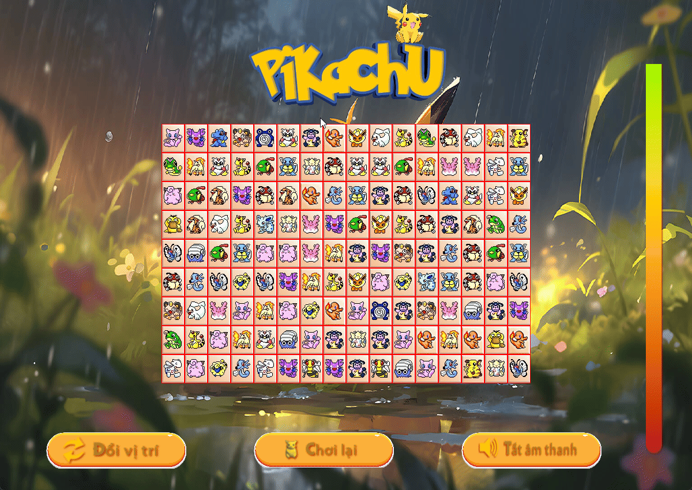

# 🎮 Pikachu Classic Game (Pygame)

## 1. Introduction

**Pikachu Classic Game** is a **tile-matching puzzle game** built with **Python and Pygame**.  
Players must connect matching Pokémon tiles with up to **three straight lines** before time runs out.

### **Key Features**
- 🟡 **Classic Tile-Matching Gameplay**  
- ⏳ **Time-Limited Challenges**  
- 🎨 **Retro Graphics Inspired by the Original Game**  
- 🎼 **Pokémon Sound Effects**  
- 🔄 **Changing Pieces & Play Again Feature**  
- 🎮 **Keyboard & Mouse Support** 

### 🎬 Gameplay Preview  


---

## 2. Prerequisites

- **Python** (3.12.3)  
- **Pygame** (2.6.1)  

---

## 3. Installation & Running the Game

### **Clone the Repository**
```sh
git clone https://github.com/tqhuy2001/Pikachu.git
```

### **Install, run and enjoy the game**
```sh
cd Pikachu
pip install -r requirements.txt # Make sure Python is installed
python main.py
```